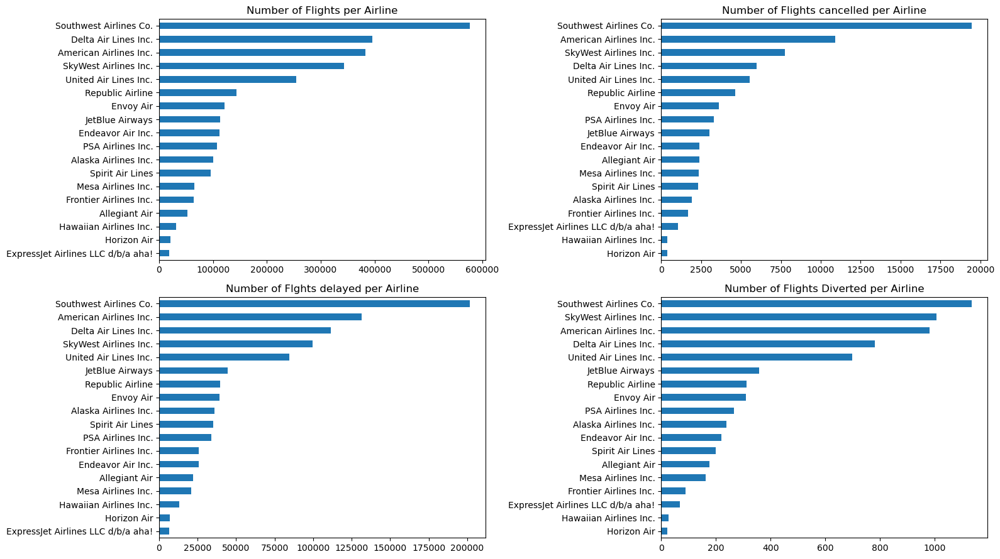
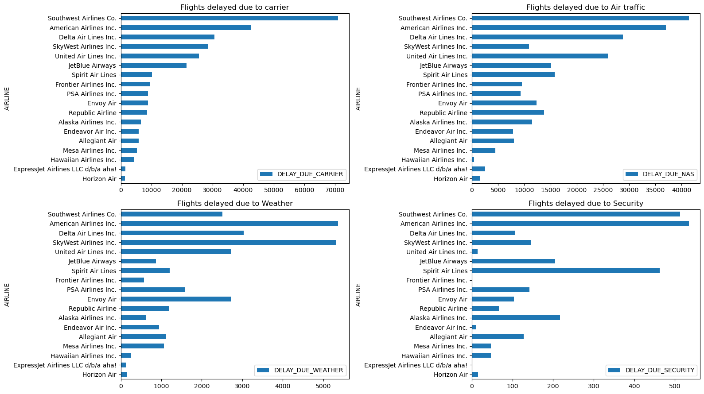
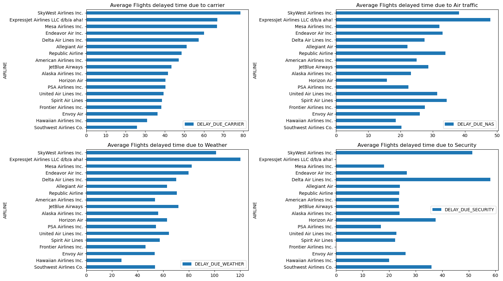
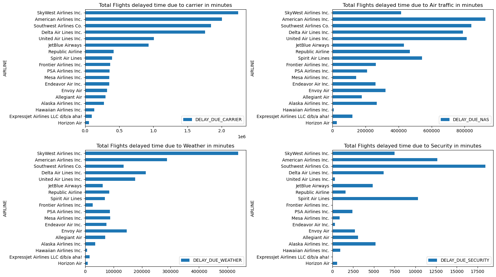
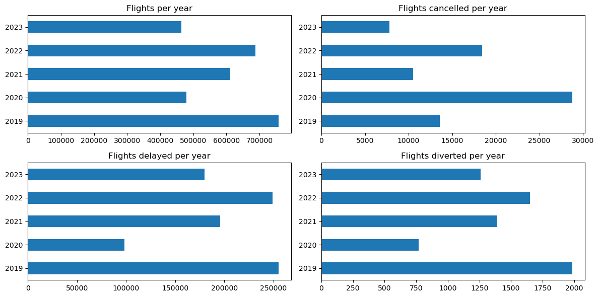

# ✈️ Flight Delay & Cancellation Analysis (2019–2023)

# 1️⃣ Introduction

Air travel delays and cancellations can cost airlines millions and affect passengers worldwide.
This project dives deep into the Flight Delay and Cancellation Dataset (2019–2023) to uncover patterns, causes, and trends behind flight disruptions in the United States.

- The goal is to understand:

- Which airlines face the most operational challenges?

- What month experience the highest delays?

- Which causes — carrier, weather, NAS (air traffic control), or security — dominate delay time?

By exploring these questions, we aim to highlight areas that can help airlines improve efficiency and passengers make informed travel choices.

# 2️⃣ Background

The dataset was obtained from Kaggle’s Flight Delay and Cancellation Dataset (2019–2023).
It includes detailed flight records such as dates, airline codes, origins, destinations, delay causes, and flight status indicators (cancelled/ delayed/ diverted).

The analysis focuses on:

- Airline-level performance

- Airport congestion

- Seasonal delay behavior

- Delay causes and their impact

Each section of the notebook explores a different perspective, combining count, mean, and total delay time visualizations to tell a complete story of flight operations.

# 3️⃣ 🛠️ Tools I Used

To clean, analyze, and visualize the data, I used:

- VS_Code — For better coding experience

- Python — main analysis language

- Pandas — data cleaning, grouping, and aggregation

- Matplotlib — custom multi-panel charts for comparisons

- Jupyter Notebook — for exploration, code, and documentation

# 4️⃣ 📊 The Analysis
## ✈️ Airline-Level Performance

- Counted flights per airline, cancellations, delays, and diversions.

- Displayed them together using subplots for a clear airline performance comparison.

## ⏰ Delay Distribution & Frequency

- Identified which airlines have the most delays.

- Analyzed which airports face the most congestion.

- Explored monthly delay trends, after converting FL_DATE to a datetime object and extracting month_name and year.

Visit code file for detailed view, link given at the bottom of this section.

## 🌦️ Delay Causes Breakdown

* For each delay cause (Carrier, Weather, NAS, Security):

### Counted how many times delays occurred (> 0).

### Calculated the mean delay time (average delay minutes).

### Summed the total delay duration (overall impact).
Each metric was visualized in a subplot grid — showing all four causes side by side for comparison.

## 📆 Yearly Trends

- Analyzed total flights, cancelled flights, delayed flights, and diverted flights per year.

- Combined these metrics into one visual to show trends and disruptions across time.

### View my notebook for detailed steps here: 
[2_insights.ipynb](6_Flight_delay_and_cancelled_project/2_insights.ipynb)

# 5️⃣ 📈 Insights

- Southwest Airlines and American Airlines had the highest number of delays and cancellations, while Delta Air Lines showed more stable on-time performance.

- Carrier and NAS (Air Traffic Control) issues were the main delay causes, followed by Weather, while Security delays were minimal.

- SkyWest Airlines faced longer average delay times, even with fewer flights, showing that smaller carriers can suffer more per delay event.

- Weather delays were mostly seasonal — peaking in winter — whereas NAS delays spiked during summer traffic.

- The total delay time was dominated by Carrier-related issues, showing that operational inefficiencies outweigh environmental factors.

- Overall, major carriers experience more delays in number, while regional airlines experience longer delays on average.

# 6️⃣ 📚 What I Learned

- Learned how to handle time data using pd.to_datetime() and extract year and month components.

- Understood how to combine multiple metrics into subplots visuals for better comparisons.

- Learned techniques to count non-zero occurrences, sum, and average specific delay causes.

- Gained insights into seasonal and airline-specific performance patterns.

- Strengthened skills in data storytelling — turning raw data into meaningful visuals and insights.

# 7️⃣ ✅ Conclusions

- Carrier-related issues are often the biggest contributors to total delay minutes.

- Weather and NAS delays dominate specific months and regions, especially in winter.

- Some airlines consistently have higher cancellation or delay rates.

- 2020 and 2021 show clear impacts of pandemic disruptions, with gradual recovery in later years.

- Combining multiple metrics revealed that both frequency and duration of delays matter for overall airline performance.
